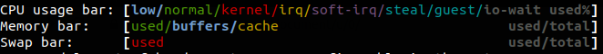

# Htop or Top

## Graph

## Columns

- PID
    - Process id
- USER
    - Owner of process
- PRI
    - The process’s priority. The lower the number, the higher the priority.
- NI
    - Nice value of process
    - [-20, 20] most to least priority
    - nice value only controls CPU time assigned to process and not utilisation of memory and I/O devices.
- VIRT
    - How much virtual memory the process is using.
- RES
    - How much physical RAM the process is using, measured in kilobytes.
- SHR
    - How much shared memory the process is using.
- S
    - The current status of the process (zombied, sleeping, running, uninterruptedly sleeping, or traced).
        - S: for sleeping (idle)
        - R: for running
        - D: for disk sleep (uninterruptible)
        - Z: for zombie (waiting for parent to read its exit status)
        - T: for traced or suspended (e.g by SIGTSTP)
        - W: for paging
        - I: Idle
- CPU%
    - The percentage of the processor time used by the process.
- MEM%
    - The percentage of physical RAM used by the process.
- TIME+
    - How much processor time the process has used
